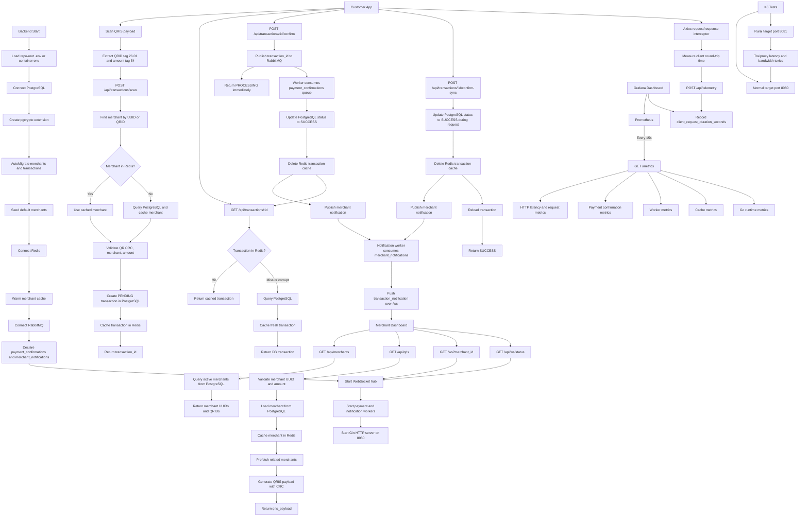

# QRIS Latency Optimizer Flow

## Notes

- PostgreSQL is the source of truth.
- Redis caches active merchants and recent transactions.
- RabbitMQ powers the optimized asynchronous confirmation path.
- RabbitMQ also carries merchant notification events.
- `/ws?merchant_id=<uuid>` streams successful payment notifications to the
  merchant dashboard.
- `/api/ws/status` exposes connection and pending-notification counts.
- `/confirm` returns `PROCESSING`; the worker later writes `SUCCESS`.
- `/confirm-sync` is the baseline synchronous path.
- Customer telemetry measures user-perceived request duration.
- Port `8080` is treated as `normal`; port `8081` is treated as `rural`.
- Toxiproxy rural mode adds 500ms latency, 100ms jitter, and about 400kbps
  bandwidth.
