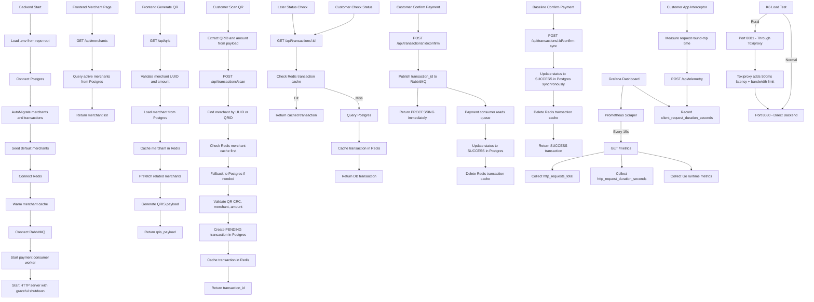

# QRIS Latency Optimizer Flow

## Notes

- Postgres is source of truth.
- Redis is cache layer for merchants and transactions.
- QRID like `TEST001` is QR payload merchant identifier.
- Merchant UUID is database primary key.
- Optimized confirm returns `PROCESSING` and finishes through RabbitMQ worker.
- Baseline confirm-sync writes to Postgres before responding.
- Prometheus collects server-side metrics via `/metrics` endpoint.
- Client telemetry measures actual user-perceived latency via Axios interceptors.
- Grafana dashboard compares server latency vs client RTT to visualize rural network lag.
- Toxiproxy simulates rural 3G conditions (500ms latency, ~400kbps bandwidth).
- K6 runs load tests against both normal and rural-simulated endpoints.
